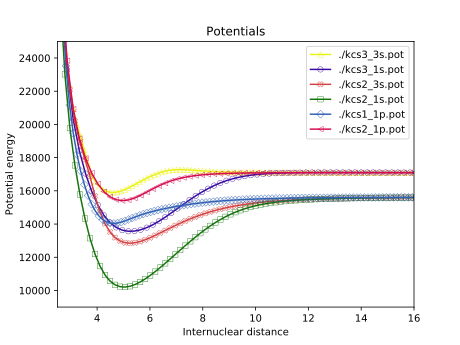
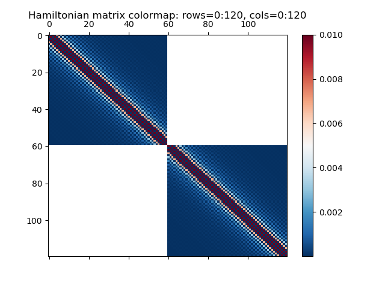

- [**DiAtom** module: what is it used for?](#diatom-module-what-is-it-used-for)
- [**DiAtom**  module: how to install and setup?](#diatom-module-how-to-install-and-setup)
- [Diatomic molecule: basic theoretical concepts](#diatomic-molecule-basic-theoretical-concepts)
  - [The total Hamiltonian and basis functions](#the-total-hamiltonian-and-basis-functions)
  - [The Scrodinger equation for a single state and coupled system of states](#the-scrodinger-equation-for-a-single-state-and-coupled-system-of-states)
  - [The interaction terms and their matrix elements](#the-interaction-terms-and-their-matrix-elements)
  - [Methods for solution of the Schrodinger equation](#methods-for-solution-of-the-schrodinger-equation)
  - [Potential Energy function models (PECs models)](#potential-energy-function-models-pecs-models)
- [Computing Energy Eigenvalues](#computing-energy-eigenvalues)
  - [Molecule Data Object Definition](#molecule-data-object-definition)
  - [Grid Object Definition](#grid-object-definition)
  - [Channel Object Definition](#channel-object-definition)
  - [Coupling Object Definition](#coupling-object-definition)
  - [Experimental Data](#experimental-data)
  - [Molecule Levels Computation](#molecule-levels-computation)
  - [Examples](#examples)
- [Fitting of the Calculated Energy Levels](#fitting-of-the-calculated-energy-levels)
  - [SVD Fit](#svd-fit)
  - [Minuit Fit](#minuit-fit)
  - [Levenberg-Marquard Fit](#levenberg-marquard-fit)
- [Computing the Transition Frequencies and Intensities](#computing-the-transition-frequencies-and-intensities)
  - [States represented by channels](#states-represented-by-channels)
  - [States represented by term values](#states-represented-by-term-values)
  - [Line strength](#line-strength)
    - [Honl-London Factors](#honl-london-factors)
    - [Frank-Condon Factors](#frank-condon-factors)
  - [Einstein A coefficient and Radiative Lifetime](#einstein-a-coefficient-and-radiative-lifetime)
- [Plotting](#plotting)


# **DiAtom** module: what is it used for?
The Python package **```DiAtom```** allows various calculations for diatomic molecules to be performed. It supports single and coupled channels computations of bound rovibrational levels, intensity calculations, fitting to the experimental data.
The current functionality covered by the program includes:
* ..
* ..

Just as an example of what you can do with **```DiAtom```** module, if you have a set of potentials for a couple of molecular electronic states represented by points (abinitio, RKR and etc.) and want to see how they look you can do something like:
<!-- 
```python
p = diatom.Plotting()
p.plot_potentials_points(['p1.pot', 'p2.pot', 'p3.pot', 'p4.pot'], show=True, ipoints=50, ylim=(1e3, 1e5))
```
or even simpler:
-->

```python
import glob

p = diatom.Plotting()
p.plot_potentials_points(glob.glob('./*.pot'), show=True, ipoints=120, xlim=(2.5, 16), ylim=(9e3, 2.5e4))
```
assuming your potential files are in the current directory.




# **DiAtom**  module: how to install and setup?

**```DiAtom```**  module can be installed from the Python software repository PyPI (Python Package Index) via pip. From Linux command line execute

```console
pip install diatom
```

and from Jupyter or IPython execute

````python
In [1]: ! pip install diatom
````
To quickly check whether the installation has been successful type

```console
python
>>> import diatom
>>> diatom
```

and the path to the \_\_init\_\_.py file in the install location should be outputed.

After installing create a new python file for example called main.py and import the diatom module

```python
#!/usr/bin/env python

import diatom
```
To execute the file from the Linux command line write
```console
python main.py
```

or type

```console
chmod u+x main.py
./main.py
```

to make the file executable and run it. To execute the file from the interactive shell of IPython (Interactive Python) type ipython then

```python
In [1]: run main.py
```

The **```DiAtom```** module is extensivly tested on Linux platform but works under Windows and MacOS as well.

# Diatomic molecule: basic theoretical concepts

## The total Hamiltonian and basis functions

The total Hamiltonian of a diatomic molecule in the rotating molecule-fixed coordinate system with origin at the center of mass of the molecule can be written as a sum of several terms:

<p align="center"></p>

where  and  are the vibrational and rotational part of the total nuclear kinetic energy operator in spherical polar coordinates,  is the kinetic energy of the electrons, 

<!-- <p align="center"></p> -->

## The Scrodinger equation for a single state and coupled system of states

<!-- omit in toc -->
### Single channel approximation for an isolated state

The energy eigenvalues of single isolated state of a diatomic molecule can be obtained by solving the radial Schrodinger equation

<p align="center"></p>

with internuclear distance labeled with , the sum of the second and the third term  from the left hand side is called effective potential energy curve, the reduced mass is  where  and  are the masses of the two atoms, J is the rotational quantum number;  are the energy eigenvalues of the rovibrational levels and  are their corresponding eigenfunctions.

<!-- omit in toc -->
### The coupled channels problem

## The interaction terms and their matrix elements

The most important operators and their matrix elements are:

- Spin-Orbit

- L-Uncoupling

- Spin-Uncoupling

- Spin-Electornic

- Spin-Rotation

- Spin-Spin

-  and  Doubling

## Methods for solution of the Schrodinger equation

Finite-Difference and Fourier Grid Hamiltonain (DVR type method) are the most frequently applied methods for numerical solution of the 1D Schordinger equation for single and coupled channels problems in molecular spectroscopy. In both methods the wavefunction is approximated over an equidistant or non-equidistant grid of points.

<!-- omit in toc -->
#### Uniform grid

In this case the grid points  in the interval from  to  are determined by:

<p align="center"></p>

where  is the number of grid points and  is the grid step

<p align="center"></p>

<!-- omit in toc -->
#### Nonuniform grid


<!-- omit in toc -->
  ### Finite-Difference Method (FD)

The second derivative of the wavefunction with respect to the internuclear distance is approximated by five-point central difference schema:

<p align="center"></p>

The kinetic energy matrix elements are then computed:

</p>

<!-- <p align="center"></p>
V_{ij} = V(R_i) \delta_{ij}
<p align="center"></p>
  V(R) = T_{e} +D_{e}[1 - e^{\beta(r-r_{e})}]^2
  <p align="center"></p> 
  V_{EMO}(R) = T_{e} + D_{e}[1 - exp(-\beta_{EMO}(R).(R-R_{e}))]^{2} 
  <p align="center"></p>
  \beta_{EMO}(R) = \sum_{i=0}^{N} \beta_{i} . y(R)^{i}
  <p align="center"></p>
  y(R) = \frac{R^{p} - R_{e}^{p}}{R^{p} + R_{e}^{p}}
  <p align="center"></p>
V_{MLR}(R) = T_{e}
<p align="center"></p>
\chi^2 = \sum_{i=1}^{n} \left[ \frac{E_{i}^{obs} - E_{i}^{cal}(\mathbf{x})}{\sigma_i} \right]^2
<p align="center"></p>
E_{i}^{obs} - E_{i}^{cal}(\mathbf{x}^{(0)}) - \sum_{j=1}^{m} \frac{\partial{E_{i}^{cal}}}{\partial x_{j}} \bigg\rvert_{x_j=x_{j}^{(0)}} \Delta x_{j} = 0
<p align="center"></p>
\min_{\mathbf{x}}\;\chi^2 = \frac{1}{\sigma^2} | \hat{A}\mathbf{x} - \mathbf{b} |^2
<p align="center"></p>
\frac{\partial E}{\partial a} = \langle \Psi \vert \frac{\partial H}{\partial a}\vert \Psi \rangle
<p align="center"></p>
\frac{1}{\sigma_{k}^{2} + 0.3(E_{k}^{exp} - E_{k}^{calc})^{2}}
$$

- **```restart```** - not yet implemented
- **```limit```** - not yet implemented
- **```regular```** - not yet implemented


To find the least-squares solution **```run_svd```** calls <a href="https://docs.scipy.org/doc/scipy/reference/generated/scipy.linalg.lstsq.html" target="_blank">scipy.linalg.lstsq</a> function. In the most widespread numerical libraries and packages the implementations which use SVD are based on the LAPACK implementation in Fortran - the routine called DGESVD.

## Minuit Fit

**```DiAtom```** provides an option to call the Minuit library in C++ via the Python frontend **```iminuit```**. It works with the Minuit Migrad subroutine for local function minimization. In addition to that it is able to estimate the uncertainty in the fitted parameters by computing the covariance and correlation matrices using two different algorithms and procedures called Hesse and Minos.

To run the Minuit Fit we should call the method **```run_minuit```** through the created **```Fitting```** object. This method has only optional parameters:

- **```niter```** - The number of iterations. Default is **```niter=0```**.
- **```step_size```** -  used to determine the initial gradient. Default is **```step_size=1.0e-4```**
- **```uncert```** - whether to compute and print the covariance and correlation matricies and the uncertainties in the in the model parameters after the fit completed. Default is **```False```**.

Example

```python
fit.run_minuit(niter=5, step_size=1.0e-3, uncert=True)
```

## Levenberg-Marquard Fit

Not yet implemented

# Computing the Transition Frequencies and Intensities

The transition frequencies between the rovibrational levels of two electronic states can be computed in two cases:
1. both states are represented by channels (as **```Channel```** objects) i.e. by potential curves 
2. both states are represented by their term values.

In either case we need first to define an object of type **```Spectrum```**:

```python
spec = diatom.Spectrum()
```

## States represented by channels

In this case we should call the method **```calculate_frequencies_by_states```** which has two required and many optional parameters.

```python
spec.calculate_frequencies_by_states(uch=1, lch=2)
```

- **```uch```** - the number of the channel corresponding to the upper electronic state
- **```lch```** - the number of the channel corresponding to the lower electronic state

All optional parameters are listed in the section below.

## States represented by term values

In this case we should call the method **```calculate_frequencies_by_term_values```** which has two required and many optional parameters.

```python
spec.calculate_frequencies_by_term_values(uch=1, lch=2)
```

- **```uterms```** - the name of the file containing the term values for the upper electronic state
- **```lterms```** - the name of the file containing the term values for the lower electronic state

-----

<!-- omit in toc -->
### Optional parameters

Both methods **```calculate_frequencies_by_states```**  and **```calculate_frequencies_by_term_values```** have the same set of optional parameters which are:


## Line strength

### Honl-London Factors

### Frank-Condon Factors

## Einstein A coefficient and Radiative Lifetime

# Plotting

The program provides some basic and simple plotting functions.



<!-- ## Cross-section -->
