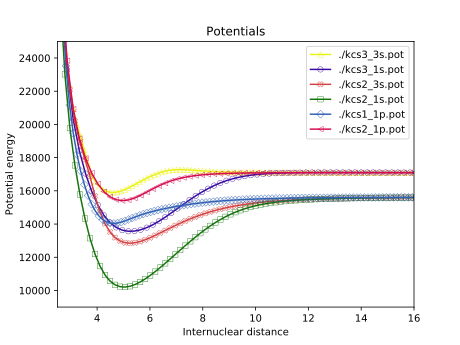
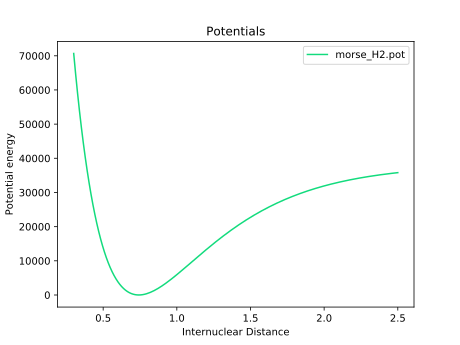
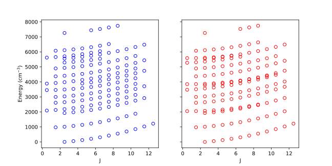
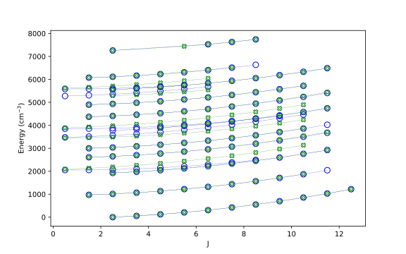
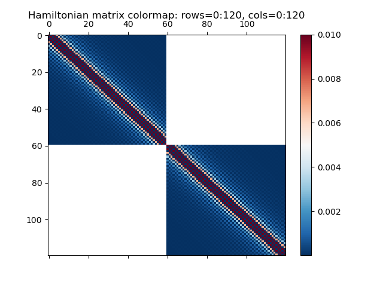

- [**DiAtomic** module: what is it used for?](#diatomic-module-what-is-it-used-for)
- [**DiAtomic**  module: how to install and setup?](#diatomic-module-how-to-install-and-setup)
- [Diatomic molecule: basic theoretical concepts](#diatomic-molecule-basic-theoretical-concepts)
  - [The total Hamiltonian and basis functions](#the-total-hamiltonian-and-basis-functions)
  - [The Scrodinger equation for a single state and coupled system of states](#the-scrodinger-equation-for-a-single-state-and-coupled-system-of-states)
  - [The interaction terms and their matrix elements](#the-interaction-terms-and-their-matrix-elements)
  - [Methods for solution of the Schrodinger equation](#methods-for-solution-of-the-schrodinger-equation)
  - [Potential Energy function models (PECs models)](#potential-energy-function-models-pecs-models)
- [Computing the Energy Eigenvalues](#computing-the-energy-eigenvalues)
  - [Molecule Data Object Definition](#molecule-data-object-definition)
  - [Grid Object Definition](#grid-object-definition)
  - [Channel Object Definition](#channel-object-definition)
  - [Coupling Object Definition](#coupling-object-definition)
  - [Molecule Levels Computation](#molecule-levels-computation)
  - [Examples](#examples)
- [Fitting of the Calculated Energy Levels](#fitting-of-the-calculated-energy-levels)
  - [SVD Fit](#svd-fit)
  - [Minuit Fit](#minuit-fit)
  - [Levenberg-Marquard Fit](#levenberg-marquard-fit)
- [Computing the Transition Frequencies and Intensities](#computing-the-transition-frequencies-and-intensities)
  - [States represented by channels](#states-represented-by-channels)
  - [States represented by term values](#states-represented-by-term-values)
  - [Line strength](#line-strength)
    - [Honl-London Factors](#honl-london-factors)
    - [Frank-Condon Factors](#frank-condon-factors)
  - [Einstein A coefficient and Radiative Lifetime](#einstein-a-coefficient-and-radiative-lifetime)
- [Plotting](#plotting)


# **DiAtomic** module: what is it used for?
The Python library **```DiAtomic```** allows various calculations for diatomic molecules to be performed. It supports single and coupled channels computations of bound rovibrational levels, intensity calculations, fitting to the experimental data.

<!-- It also provides some usefull plotting options, for example, if we have a set of files for electronic potentials represented by points (abinitio, RKR and etc.) and want to see how they look then: -->


<!-- ```python
p = Plotting()
p.plot_potentials_points(['p1.pot', 'p2.pot', 'p3.pot', 'p4.pot'], show=True, ipoints=50, ylim=(1e3, 1e5))
```
or even simpler:-->

<!-- ```python
from diatomic import *
import glob

Plotting.plot_potentials_points(glob.glob('./*.pot'), show=True, ipoints=120, xlim=(2.5, 16), ylim=(9e3, 2.5e4))
```
 -->

# **DiAtomic**  module: how to install and setup?

**```DiAtomic```**  module can be installed from the Python software repository PyPI (Python Package Index) via pip. From Linux command line execute

```console
pip install diatomic
```

and from ```Jupyter``` or ```IPython``` execute

````python
In [1]: ! pip install diatomic
````
To quickly check whether the installation has been successful type
```console
python
>>> import diatomic
>>> diatomic
```
which should show the path to the ```__init__.py``` file in the install location.

After installing create a new python file for example called main.py and import the diatomic module

```python
#!/usr/bin/env python

from diatomic import *
```
To execute the file from the Linux command line write
```console
python main.py
```

or type

```console
chmod u+x main.py
./main.py
```

to make the file executable and then run it. To execute the file from the ```IPython``` (Interactive Python) shell enter

```python
In [1]: run main.py
```

The **```DiAtomic```** module is tested on Linux platform but works under Windows and MacOS as well.

# Diatomic molecule: basic theoretical concepts

## The total Hamiltonian and basis functions

The total Hamiltonian of a diatomic molecule in the rotating molecule-fixed coordinate system with origin at the center of mass of the molecule can be written as a sum of several terms:

$$
\mathbf{H} = \mathbf{T}_{\mathrm{N}}(R) + \mathbf{H}_{\mathrm{rot}}(R, \theta, \phi) + \mathbf{T}_{\mathrm{e}}(r) + \mathbf{V}(R, r) + \mathbf{H}_{\mathrm{rel}}
$$

where $\mathbf{T}_{\mathrm{N}}(R)$ and $\mathbf{H}_{\mathrm{rot}}(R, \theta, \phi)$ are the vibrational and rotational part of the total nuclear kinetic energy operator in spherical polar coordinates, $\mathbf{T}_{\mathrm{e}}(r)$ is the kinetic energy of the electrons, $\mathbf{V}(R, r)$ is the operator for the total potential energy of the system and $\mathbf{H}_{\mathrm{rel}}$ is the relativistic Hamiltonian.

Usually the most convinient set of basis functions for computing the matrix elements of the Hamiltonian are the Hund's case (a) basis functions represented as:

$$
\vert \Lambda \: S \: \Sigma \: J \: \Omega \: M; e/f \rangle =
2^{-1/2} \left[ \vert \Lambda \: S \: \Sigma \: J \: \Omega \: M 
\rangle \pm \vert -\Lambda \: S \: -\Sigma \: J \: -\Omega \: M \rangle  \right]
$$

## The Scrodinger equation for a single state and coupled system of states

<!-- omit in toc -->
### Single channel approximation for an isolated state

The rovibrational energies and wavefunctions of an isolated electronic state of a diatomic molecule can be obtained by solving the radial Schrodinger equation:

$$
\left[ \frac{-\hbar^{2}}{2\mu} \frac{d^{2}}{dR^{2}} + U(R) + \frac{\hbar^{2}}{2\mu R^{2}}(J(J+1) - \Omega^2) \right] \phi_{vJ}(R) = E_{vJ} \phi_{vJ}(R)
$$

where $R$, is the internuclear distance, $\mu = M_{1} M_{2} /(M_{1} + M_{2})$ is the reduced molecular mass with atomic masses $M_1$ and $M_2$, $J$ is the rotational quantum number; $E_{vJ}$ are the energies of the rovibrational levels and $\phi_{vJ}$ are the corresponding eigenfunctions.

<!-- omit in toc -->
### The coupled channels problem

For a system of coupled electronic states a more general set of coupled equations is solved:

$$
\sum_{i=1}^{N} H_{ki}\phi_{i}(R) = E\phi_{k}(R)
$$

where $H_{ki}$ are the matrix elements of the total Hmiltonian between the Hund's case (a) basis functions

## The interaction terms and their matrix elements

The most important operators and their matrix elements are:

- Spin-Orbit

- L-Uncoupling

- Spin-Uncoupling

- Spin-Electornic

- Spin-Rotation

- Spin-Spin

- Second-Order Corrections

## Methods for solution of the Schrodinger equation

Finite-Difference and Fourier Grid Hamiltonain (DVR type method) are the most frequently applied methods for numerical solution of the 1D Schordinger equation for single and coupled channels problems in molecular spectroscopy. In both methods the wavefunction can approximated over an uniform or non-uniform grid of points.

<!-- omit in toc -->
#### Uniform grid

In this case the grid points $R_i$ in the interval from $R_{min}$ to $R_{max}$ are determined by:

$$
R_i = R_{min} + (i-1)\Delta_{R},
$$

for $i = 1 \dots N_{R}$, where $N_{R}$ is the number of grid points and $\Delta_{R}$ is the grid step

$$
\Delta_{R} = \frac{R_{max} - R_{min}}{N_{R} - 1}
$$

<!-- omit in toc -->
#### Nonuniform grid


<!-- omit in toc -->
  ### Finite-Difference Method (FD)

The second derivative of the wavefunction with respect to the internuclear distance is approximated by five-point central difference schema:

$$
\psi''(R_{i}) \approx -\frac{1}{\Delta R^2}\left[ \frac{1}{12} \left( 30\psi_i - 16(\psi_{i+1} +\psi_{i-1}) + (\psi_{i+2} + \psi_{i-2}) \right) \right]
$$

The kinetic energy matrix elements are then computed:

$$
T_{ij} = \frac{\hbar^2}{2\mu \Delta R^2} \times
\begin{dcases}
\frac{5}{2}, & j = i\\
-\frac{4}{3}, &  j = i\pm 1\\
\frac{1}{12}, & j = i\pm 2
\end{dcases}
$$

This is a banded symmetric matrix. The potential energy matrix is diagonal:

$$
V_{ij} = V(R_i) \delta_{ij}
$$


<!-- omit in toc -->
  ### Fourier Grid Hamiltonian (FGH)

FGH is a type of a collocation (pseudospectral) method in which the solution is approximated over a special grid points called collocation points.

<!-- omit in toc -->
#### **Sinc basis**

In sinc basis the kinetic energy matrix elements are computed as:

<!-- omit in toc -->
#### **Fourier basis**

## Potential Energy function models (PECs models)
- Pointwise potential

- Analytical potential
   - Morse potential

  The Morse potential function is defined as:

  $$
  V(R) = T_{e} +D_{e}[1 - e^{\beta(R-R_{e})}]^2
  $$
  where $T_e$ is the term value, $D_{e}$ measures the energy from the bottom of the potential to the dissociation limit, $\beta$ is a constant and $R_{e}$ is the equilibrium internuclear distance.

   - EMO (Expanded Morse Oscillator) potential

  It is defined as

  $$ 
  V_{EMO}(R) = T_{e} + D_{e}[1 - exp(-\beta_{EMO}(R).(R-R_{e}))]^{2} 
  $$

  which is a Morse potential function with a radial dependence of the exponential coefficient

  $$
  \beta_{EMO}(R) = \sum_{i=0}^{N} \beta_{i} . y(R)^{i}
  $$

  represented as a polynomial expansion in the powers of the dimensionless function

  $$
  y(R) = \frac{R^{p} - R_{e}^{p}}{R^{p} + R_{e}^{p}}
  $$

  with p being a positive integer number.

   - MLR (Morse/Long-Range) potential

<!-- $$
V_{MLR}(R) = T_{e}
$$ -->

# Computing the Energy Eigenvalues

## Molecule Data Object Definition

Initially an object of type **```MoleculeData```** should be instantiated like:

```python
# creating MoleculeData object called mdata
mdata = MoleculeData()
```

The basic input information about the molecule should be defined by the following properties via the created **```MoleculeData```** object:

<!-- omit in toc -->
### Reduced masses and isotopes

There are two ways for specifing the reduced mass.

- **```molecule```** - defines one or more isotopic forms of the same molecule by specifing their chemical symbols i.e. each defined item corresponds to a diffrent isotope of the same molecule.
  - the molecule symbols should be in the format: 'M1A1M2A2' where M1/M2 are the mass numbers and A1/A2 are the chemical symbols of the first/second atom (spaces are allowed).
  - The reduced masses for each isotope will be computed automatically using the <a href="https://www.nist.gov/pml/atomic-weights-and-isotopic-compositions-relative-atomic-masses" target="_blank">NIST atomic database</a>
  - this property does not determine which and how many isotopes will be included in the calculations (refer to the property **```nisotopes```** below) but only defines the isotopes by the symbols.
  - it should be an iterable of type list or tuple of strings and is not mandatory

In the following example the symbols for three of the isotopes of NiH molecule - $^{58}\textrm{NiH}$, $^{60}\textrm{NiH}$ and $^{62}\textrm{NiH}$ are defined as: 

```python
# define the symbols for three isotopes
mdata.molecule = ['58Ni1H', '60Ni1H', '62Ni1H']

# it also works with spaces between the symbols
mdata.molecule = ['58 Ni 1 H', '60Ni 1H', '62 Ni 1H']
```

- **```masses```** - defines one or more isotopic forms of the same molecule by specifing the values of their reduced masses i.e. each defined item represents the reduced mass for each isotope computed by $\mu = m_{A}*m_{B} / (m_{A} + m_{B})$ in amu units.
  - this property does not determine which and how many isotopes will be included in the calculations (refer to the property **```nisotopes```** below) but only defines their masses.
  - it should be an iterable of type list or tuple of float numbers and is not mandatory

```python
# define the reduced masses for three of NiH isotopes
mdata.masses = [0.990592988928, 0.991157254368, 0.991686280089]

# or from the masses of the separate atoms
mA, mB = 1.00782503223, 57.94453305
mdata.masses = [mA * mB / (mA + mB)]
```

> **_NOTE:_** At least one of the above two properties (**```molecule```** or **```masses```**) should be specified (i.e. one of them is mandatory).

- **```nisotopes```** - the isotopes which to be included in the compuations
  - each number corresponds to the index of an isotope in the list of defined isotopes; the counting starts from 1 up to the number of items in **```molecule```** or **```masses```**
  - it should be a list or tuple of integer numbers and is mandatory.

In this example the computations will be performed only for the second and the third isotope:
```python
# define the masses of 3 isotopes
mdata.molecule = ['58Ni1H', '60Ni1H', '62Ni1H']

# but compute only for the 2nd and the 3rd one
mdata.nisotopes = [2, 3]
```

<!-- omit in toc -->
### Values of the rotational quantum number J

- **```jrange```** - defines the interval of rotational qunatum numbers which to be used in the computations.
  - specify the initial and the final value of the required range of rotational quantum numbers
  - it is an iterable of type list or tuple containing only 2 elements (integer or float numbers)

```python
# the J values will be: 0, 1, 2, 3, 4 and 5
mdata.jrange = (0, 5)
```

- **```jvalues```** - defines a specific set of values for the rotational qunatum number
  - it could be a single number or list of numbers defined as type list/tuple of integer or float numbers

```python
# the J values will be: 7.5, 8.5, 11.5, 12.5
mdata.jvalues = (7.5, 8.5, 11.5, 12.5)
```

In the below example the values of the rotational quantum number that will be used in the calculations are: 0.5, 1.5, 2.5, 3.5, 4.5, 10.5, 12.5, 15.5, 16.5

```python
mdata.jrange = (0.5, 4.5)
mdata.jvalues = (10.5, 12.5, 15.5, 16.5)
```
> **_NOTE:_** At least one of the properties **```jvalues```** or **```jrange```** is mandatory i.e. either one or both should be set.

<!-- omit in toc -->
### Parity labels

- **```parities```** - parity levels which to be computed. 
  - we use a convention for designating the parity labels with numbers 1 and 0 for e and f respectivly.
  - it accepts a sinle value or tuple/list of one or two values of integer type (0 or 1).
  - not mandatory; if it is not set both e- and f-levels will be computed by default.

```python
# both e- and f-levels will be computed
mdata.parities = 0, 1

# only e-levels will be computed
mdata.parities = 1
```

<!-- omit in toc -->
### Reference level

- **```referenceJ```** - a reference J level whose energy will be used for shifting all remaining levels during the computations
  - the e/f levels and also the levels corresponding to different isotopes in general might be shifted with different energy
  - integer or float number

- **```referenceE```** - a reference energy value which will be used for shifting all levels i.e. all levels will be shifted with the same value
  - integer or float number

Examples:
```python
mdata.referenceJ = 2.5
```

```python
mdata.referenceE = 1000.
```
None of them is mandatory. **
```referenceJ```** has higher proprity if both are specified simultaneously.

<!-- omit in toc -->
### Experimental Data

Experimental data can be provided if we call the method **```get_exp_data```**:

```python
mdata.get_exp_data('exp_KCs.dat', markers=[1,2,3,11,12])
```

The only required parameter is the name of the file containing the experimental data. **```markers```** is an optional parameter which allows the program to differentiate between the data of the isotopes. The markers are provided as a separate column in the experimental data file (see below).

---
<!-- omit in toc -->
#### **Structure of the experimental data file**

```python
298
      1       0     2.5        0.000000      1        0.0050   5        5   
      2       0     2.5        0.000000      0        0.0050   5        5   
      3       0     3.5       53.827000      1        0.0050   5        5   
      4       0     3.5       53.827000      0        0.0050   5        5   
      5       0     4.5      122.962000      1        0.0050   5        5   
      6       0     4.5      122.962000      0        0.0050   5        5   
      7       0     5.5      207.352000      1        0.0050   5        5   
      8       0     5.5      207.352000      0        0.0050   5        5   
      9       0     6.5      306.935000      1        0.0050   5        5   
     10       0     6.5      306.935000      0        0.0050   5        5
```

The first row is the number of data which should be included in the computations. The columns are as follows: counter, the vibrational quantum number, the rotational qunatum number, the experimental energy value, parity label (0 or 1), experimental uncertainty, marker and state. Levels with markers between 0 and 9 belong to the first isotope, levels with merkers between 10 and 19 belong to the second isotope and so on. The markers also provide convinient and easy way to temporary exculde some levels from the computations or group them by common characteristics.

---

## Grid Object Definition
We need to instanciate an object of type **```Grid```** in order to define the parameters releated to the mesh of points for the considered problem. Uniform and non-uniform type of grids are supported. The parameters that are needed to initilize the **```Grid```** object are:
- **```npoints```** - the number of grid points
    - It should be a positive integer number
  
- **```rgrid```** - the range of internuclear distancies .
    - specify the initial and the final values of the R grid.
    - a tuple/list containing two integer or float numbers

We may provide an additional (optional) parameter:
- **```solver```** - the method used for solution of the Schrodinger equation
    - The initialization of the grid depends on which solver method is selected.
    - It should be a string and the following values are available:
      - **```'sinc'```**
      - **```'fourier'```**
      - **```'fd5'```**

      If one of the values **```'sinc'```** or **```'fourier'```** is selected then FGH (Fourier Grid Hamiltonian) method will be used for the solution of the Schrodinger equation. If 'fd5' option is selected the Schrodinger equation will be solved by Finite Diffrence method.**```'sinc'```** is set by default option.

> **_NOTE:_** All parameters in program with values of type string are case-insensitive.

<!-- omit in toc -->
### Uniform grid
In order to generate an equdistant set of points **```npoints```** and **```rgrid```** are the only required parameters. 

This example shows how to initialize the grid object for uniform grid.
```python
# create a uniform grid of points
grid = Grid(npoints=100, rgrid=(1.0, 3.0))
```

<!-- omit in toc -->
### Nonuniform grid
For the generation of the nonuniform grid an analytical mapping procedure is applied. In this case **```alpha```** and **```rbar```** parameters should be set.

- **```alpha```** - the power parameter used in the analytical mapping formulas
  - It should be a positive integer or float number
  - If this parameter has a negative value then uniform grid without mapping will be generated. This allows one to easyly switch between uniform and nonuniform grid reperesentations.
- **```rbar```** - the value of this parameter is usually close to the internuclear distance

This example shows how the grid object should be initialized for nonuniform grid.

```python
# create a nonuniform grid of points
grid = Grid(npoints=100, rgrid=(1.0, 3.0), solver='sinc', alpha=3.0, rbar=1.458)
```
----
We can see how the generated grid of points looks by calling the function
**```get_grid_points```**
```python
print(grid.get_grid_points())
```
which will produce an output like

```python
[1.41729459 1.48936042 1.56142625 1.63349207 1.7055579  1.77762373
 1.84968955 1.92175538 1.99382121 2.06588703 2.13795286 2.21001869
 2.28208451 2.35415034 2.42621617 2.498282   2.57034782 2.64241365
 2.71447948 2.7865453  2.85861113 2.93067696 3.00274278 3.07480861
 3.14687444 3.21894026 3.29100609 3.36307192 3.43513774 3.50720357
 3.5792694  3.65133522 3.72340105 3.79546688 3.8675327  3.93959853
 4.01166436 4.08373018 4.15579601 4.22786184 4.29992766 4.37199349
 4.44405932 4.51612515 4.58819097 4.6602568  4.73232263 4.80438845]
```
or we can save the generated grid points in file by writing

```python
import numpy as np

np.savetxt('grid_points.dat', grid.rgrid)
```

## Channel Object Definition

A channel is defined as an electronic state with definite values of $\Lambda$, $S$, $\Sigma$ and $\Omega$ quantum numbers. Each channel has to be defined as an object of type **```Channel```** and the parameters that are needed to instatniate objects of this type are:

- **```filep```** - the name of the file containing the parameters for the potential
  - It is a string parameter referring to an existing file or file path
  - The structure of the file depends on which model function is selected by the propery **```model```** described below.
- **```model```** - defines the potential energy function model (PEC model); it could be a pointwise function, builtin analytical potential function or custom analytical potential function (defined by the user). The possible values are:
  - **```'pointwise'```** : pointwise potential with cubic spline interpolation using the **```scipy```** builtin class <a href="https://yaml.org/" target="_blank">scipy.interpolate.CubicSpline</a>
  - **```'cspline'```** : pointwise potential with cubic spline interpolation using our own implementation
  - **```'Morse'```** : Morse potential
  - **```'EMO'```** : EMO (Expanded Morse Oscilator) potential
  - **```'MLR'```** : MLR (Morse/Long-Range) potential
  - **```'custom'```** : custom analytical potential
- **```nlambda```** - the quantum number $\Lambda$ of the state
  - positive integer number
- **```sigma```** - the quantum number $\Sigma$ of the state
  - integer or float number
- **```multiplicity```** - the multiplicity defined as $2S+1$ for the state
  - positive integer or float number
- **```rot_correction```** - correction to the diagonal rotational Hamiltonian
  - optional parameter of type integer or float


Here is an example definition of **```Channel```** object (for readability the parameters are written on separate lines):
```python
ch1 = Channel(
    filep='poten_morse.pot',
    model='morse',
    nlambda=0,
    sigma=0,
    multiplicity=1,
    rot_correction=0.
)
```

----
<!-- omit in toc -->
#### **Structure of the potential files**

- for pointwise potentials i.e. **```model='pointwise'```** or **```model='cspline'```** the potential file looks like

```python
13
    1.1168478261      14200.41785382920    0
    1.2146739130       8607.83894098507    0
    1.2880434783       5683.93800056556    0
    1.3858695652       2976.97391482846    0
    1.5081521739       1953.39920190690    0
    1.6304347826       2525.33711155168    0
    1.7527173913       4070.10001126557    0
    1.8505434783       5627.41358380562    0
    1.9728260870       7828.95851896513    0
    2.0859375000      10124.81139863041    0
    2.2265625000      12893.01493454805    0
    2.3671875000      15520.09623454644    0
    2.5078125000      17570.48597865039    0
```

It contains 3 columns. The first column determines the grid points, the second column are the values of the potential at these points, the third column is required when running the fitting procedure and tells whether the parameter is fixed or free. On the top of the file the number of points is specified.

- for Morse potential i.e. **```model='Morse'```**

```
Te = 1.00000000e-05  0
De = 1.00000000e+01  0
a  = 1.00000000      0
re = 1.27463182      0
```

- for EMO potential i.e. **```model='EMO'```**

```
Te =    1.00000   1
De =    1000.00   0
p  =    2         1
N  =    2         1
b0 =    1.00000   1 
b1 =    1.10000   1
b2 =    1.10000   1 
re =    1.27455   1
```

- for MLR potential i.e. **```model='MLR'```**

...
- for custom potential i.e. **```model='custom'```**

```
param1 = 4.5e-11   0
param2 = 4.5e-05   0
param3 = 9.9e-01   0
param4 = 2.4e+01   0
param5 = 8.4e+04   0
param6 = 5.1e+00   0
```

----

- **```custom_function```** - the name of some analytical function defined by the user

  - it is a python function defined in the current or in any other *.py file. In this case the parameter **```model```** has to be set to 'custom'.
  - it accepts exactly 2 input parameter and should return a single parameter. The first input parameter is an array containing the values of the potential parameters as defined in the potential file through the parameter **```filep```**. In this file the parameters have to be defined with the keyword 'param' followed by the number of corresponding parameter as is shown in the example below. The second input argument is an array containing the grid points. The output parameter has to be an array containing the calculated values of the potential function on the grid points. The length of the returned array should be equal to the number of grid points.

  - all input and output arguments are 1D **```numpy```** arrays of type **```'numpy.ndarray'```**.
  - it is an optional parameter

A simple example of a user defined function implementing the Morse potential is shown here:

```python
import numpy as np

def VMorse(params, rgrid):

    # unpacking the input parameters
    Te, De, a, re = params

    # returns the values of the Morse function over the grid
    return Te + De * np.power((1.0 - np.exp(-a*(rgrid-re))), 2.0)
```
In this case the parameters in the potential file are defined in the following way:

```
param1 = 4.55633525e-11   0
param2 = 4.55633525e-05   0
param3 = 9.99989591e-01   0
param4 = 2.40869887e+00   0
```
Note the special construction 'param+number' with conscuitive numbers starting from 1. In the input array the parameters will be aranged by this number.

> **_NOTE:_** Note that all parameters releated to the custom potential should be in au units!

Afterwards we need to create a list containing all  **```Channel```** obejcts which will be included the following compuations then call the function **```set_channel_parameters```** and pass the created list with channels as an argument to it:

```python
# combine the defined channels ch1 and ch2 in one list
channels = [ch1, ch2]

# then pass it to the function
Channel.set_channel_parameters(channels)
```

## Coupling Object Definition

The interactions between the channels are represented as objects of type **```Coupling```**. The parameters that we need to provide in order to initilize a **```Coupling```** object are:

- **```interact```** - the channels which will be connected by this coupling object
  - should be of type tuple or tuple of tuples
  - the numbers should correspond to the indicies of the channels in the channel list

- **```coupling```** - the type of the interation with the following available options:
  - **```spin-orbit```** : the diagonal and off-diagonal Spin-Orbit (SO) interaction
  - **```LJ```** : L-uncoupling interaction
  - **```SJ```** : Spin-uncoupling interaction
  - **```SL```** : Spin-electronic interaction
  - **```spin-rot```** : Spin-Rotation interaction
  - **```spin-spin```** : Spin-Spin interaction
  - **```LambdaDe```** : second-order $\Omega$ or $\Lambda$ doubling effect on e-parity levels
  - **```LambdaDf```** : second-order $\Omega$ or $\Lambda$ doubling effect on f-parity levels
  - **```LambdaD```** : second-order $\Omega$ or $\Lambda$ doubling effect on both e- and f-parity levels

- **```model```** - the model used to represent the coupling function; the possible values are:
    - **```pointwise```**
    - **```cspline```**
    - **```custom```**

- **```multiplier```** - integer or float number which will multiply the defined coupling function
  - if not provided the default value will be set to 1.0

- **```label```** - a label used to connect a certain coupling object and the corresponding parameters in the couplings file. 
  - should be of type string

In the following example the channels 1 and 2 (the indices of the channels in the channels list) are coupled by spin-orbit interaction and the coupling function is represented as a pointwise function. In the couplings file the group of parameters corresponding to this function are labeled by 'SO_WX':

```python
cp1 = diatom.Coupling(
    interact=(1, 2),
    coupling='spin-orbit',
    model='pointwise',
    multiplier=1.0,
    label='SO_WX'
)
```
----

<!-- omit in toc -->
#### **Structure of the Couplings File**

The file containing the coupling parameters has simple arrangement (using <a href="https://yaml.org/" target="_blank">YAML</a> syntax). For pointwise functions the file consists of three columns which have the same meaning like the columns in the potential file explained above.

```yaml
SO_WW:
- 0.750000000000     -293.99399462737216      1
- 1.200000000000     -290.42170562514940      1
- 1.500000000000     -293.15717613189383      1
- 2.000000000000     -305.89587377923857      1
- 3.000000000000     -301.49757866107001      0
SO_XX:
- 0.750000000000     -593.76650250990258      1
- 1.200000000000     -590.12555102463773      1
- 1.500000000000     -599.74203565802293      1
- 2.000000000000     -604.06421264445430      1
- 3.000000000000     -603.00000000000000      0
```

Before decalring each group of parameters the label to the corresponding **```Coupling```** object needs to be specified.

----
<!-- omit in toc -->
#### Shared parameters

When two or more interacting states coupled by the same or different interactions share the same set of parameters a more complicated construction of the **```Coupling```** object is possible.
This is what frequently happens in the case of states coupled by the $L_+$ operator. Here is an example for the interaction ${^2\Pi}$ ~ $^2\Delta$ in the lowest doublet states of NiH molecule:

```python
cp2 = Coupling(
    interact=((2,4), (3,5), (3,4)),
    coupling=('LJ', 'LJ', 'SL'),
    model='pointwise',
    multiplier=(2.0, 2.0, 2.0),
    label='cp2'
)
```

If we have defined the channels 2, 3, 4 and 5 as ${^2\Pi_{1/2}}$, $^2\Pi_{3/2}$, $^2\Delta_{3/2}$ and $^2\Delta_{5/2}$ then the pairs (2,4), (3,5) and (3,4) are connected by the same $L_+$ operator in two different rotational interactions. Defined in this way they will use the same set of parameters - those labeled by 'cp2'. This type of definition is ....... 
<!-- We could define each of these pairs of interacting states as separate **```Coupling```** objects each having labels and the results will be the same. But then the fit will treat them ..... -->

## Molecule Levels Computation
<!-- omit in toc -->
### Calculate the eigenvalues and eigenvectors

To compute the eigenvalues an object of type **```MoleculeLevels```** should beinitialized with three required and one optional parameters as in the example:

```python
mlevels = MoleculeLevels(mdata, grid, channels, couplings=couplings)
```

The first parameter is the created [Molecule Data](#Molecule-Data-Definition) object, the second one is the created [Grid](#grid-definition) object and the third one is the created list with [Channel](#channel-definition) objects.
The optional parameter is created list of [Coupling](#coupling-definition) objects.

- **```eig_decomp```** - defines the  <a href="https://docs.scipy.org/" target="_blank">SciPy</a>  procedure which to be used for eigenvalues decomposition; the two possible values are:

  - **```'lapack'```** : calls the **```scipy```** builtin 
    <a href="https://docs.scipy.org/doc/scipy/reference/generated/scipy.linalg.eigh.html" target="_blank">scipy.linalg.eigh</a> function to compute the eigenvalues and eigenvectors.

  - **```'arpack'```** : calls the **```scipy```** builtin
    <a href="https://docs.scipy.org/doc/scipy/reference/generated/scipy.sparse.linalg.eigsh.html#scipy.sparse.linalg.eigsh" target="_blank">scipy.sparse.linalg.eigsh</a> function to compute the eigenvalues and eigenvectors.

  These two **```scipy```** procedures provide high-level interface to standard LAPACK and ARPACK routines written in Fortran and C. Default value is **```'lapack'```**

<!-- omit in toc -->
#### **Eigenvalue Decomposition with LAPACK**

This is the recommended choice when FGH is selected as a solving method.

If we need the eigenvalues and the eigenvectors only in a certain range of values or indicies then it is recommended to use one of the following two parameters whcih will likely reduce the computations time:

- **```energy_subset_index```** - defines the first and the last index of the subinterval of indicies for the returned eigenvalues

  - iterable of type list/tuple with 2 integer numbers defining the two indicies

    ```python
    mlevels.calculate_levels(energy_subset_index=(0, 6))
    ```

- **```energy_subset_value```** - defines the smallest and the largest value of subinterval of values for the returned eigenvalues

  - iterable if type list/tuple with 2 integer or float numbers defining the smallest and the largest value

    ```python
    mlevels.calculate_levels(energy_subset_value=(1000., 3000.))
    ```

  > **_NOTE:_**  If neither is used then all possible eigenvalues and thier eigenvectors will be computed and returned

- **```lapack_driver```** - the lapack routine computing the eigenvalues and eigenvectors; the possible values are:
    - **```'ev'```**  : calls dsyev routine which computes _all_ eigenvalues and eiegnvectors of a real symmetric matrix
    - **```'evd'```** : calls dsyevd routine which computes _all_ eigenvalues and eiegnvectors for real symmetric matrix using a divide and conquer algorithm
    - **```'evr'```** : calls dsyevr routine which computes a _selected_ eigenvalues and eigenvectors of a real symmetric matrix using the RRR algorithm
    - **```'evx'```** : calls dsyevx routine which computes a _selected_ eigenvalues and eiegnvectors of a real symmetric matrix

  The default value is set to **```'evr'```** which in general is the recommended choice. **```'evx'```** is faster when only a few of the eigenvalues are desired. **```energy_subset_index```** and **```energy_subset_value```** cannot be used together with **```'ev'```** and **```'evd'```** because they compute all eigenvalues.

    ```python
    mlevels.calculate_levels(eig_decomp='lapack', lap_driver='evx')
    ```

<!-- omit in toc -->
#### **Eigenvalue Decomposition with ARPACK**
ARPACK procedure is efficient and suitable for finding the _largest_ eigenvalues of a sparse matrix especially when a few of them are needed. If the _smallest_ eigenvalues need to be computed then it is recommended to use a shift-invert mode. In this mode the original eigenvalue problem will be transformed to an eqivalent problem so that the original small eigenvalues u will correspond to the transformed large eigenvalues v: v = 1 / u

For further information: https://docs.scipy.org/doc/scipy/reference/tutorial/arpack.html

The releated parameters are:
- **```arpack_k```** - the dsired number of eigenvalues and eigenvectors
  - it is a positive integer number and should be smaller than the dimension of the matrix 
- **```arpack_which```** - which eigenvalues to compute
  - The possible values are: **```'LM'```** (largest in magnitude), **```'SM'```** (smallest in magnitude), **```'LA'```** (largest algebraic), **```'SA'```** (smallest algebraic), **```'BE'```** (half (k/2) from each end of the spectrum).
- **```arpack_sigma```** - if this parameter is specified a shift-invert mode is applied. Then the procedure will return k (specified by **```arpack_k```**) shifted eigenvalues which have values around the specified value of this parameter (integer or float number).
  
  - efficient when the smallest eigenvalues are required (**```arpack_which```**=**```'SM'```**)

```python
mlevels.calculate_levels(eig_decomp='arpack', arpack_k=25, arpack_which='SM', arpack_sigma=0.1)
```
> **_NOTE:_** With ARPACK it is not possible to compute all eigenvectors of a matrix.

> **_NOTE:_** The parameters **```lapack_driver```**, **```subset_by_index```** and **```subset_by_value```** are not relevent when **```eig_decomp```**='arpack'.
Similarly **```arpack_k```**, **```arpack_which```** and  **```arpack_sigma```** are not relevent when **```eig_decomp```**='lapack'

<!-- omit in toc -->
### Identification of computed levels
- **```identify```** - defines the method for identification of the calculated energies i.e. the procedure used for the assignment of vibrational quantum number for each level and the determination of the state which it belongs to based on the available experimental data.
  - integer number with 2 possible values:
    - **```0```** : identification by energy
    - **```1```** : identification by the largest value of the coupling coefficient
    <!-- - _2_ : a slow version of _0_; defined and used only for debugging puropse
    - _3_ : a slow version of _1_; defined and used only for debugging puropse -->
  - defult value is set to **```0```**
  - it is not relevent when experimental data are not provided

<!-- omit in toc -->
### Output Format and Storing Options

- **```store_predicted```** - whether to save _all_ computed eigenvalues in file
  - the predicted  eigenvalues will be written in file called 'evalues_predicted.dat'. The name of this file can be changed if additional parameter **```predicted_file```** is added.

The file looks like:

```python
#     No  v      Ecalc          J   parity  marker   CC1   state   lambda  omega
      1   0      56.113986     1.0     0      1     1.000      1      0     0.00
      2   1     180.940849     1.0     0      1     1.000      1      0     0.00
      3   2     387.925302     1.0     0      1     1.000      1      0     0.00
      4   3     677.259248     1.0     0      1     1.000      1      0     0.00
      5   4    1049.088043     1.0     0      1     1.000      1      0     0.00
      6   5    1503.471257     1.0     0      1     1.000      1      0     0.00
```
  
- **```store_info```** - save more detailed information regarding the computations
  
- **```store_evecs```** - save the computed eigenvectors in files

- **```sort_output```** - sort the selected eigenvalues by provided column numbers in order

- **```sort_predicted```** - sort all computed eigenvalues by provided column numbers in order

## Examples

<!-- omit in toc -->
### The minimal working example: Morse potential for $\mathrm{H}_2$

This is an example with the minimal set of nessecary parameters for running a single channel computations with the Morse potential for $\mathrm{H}_2$ molecule.

It is done with only a few lines of code.

```python
#!/usr/bin/env python

from diatomic import *

mdata = MoleculeData()
mdata.molecule = ['1H1H']
mdata.nisotopes = [1]
mdata.jrange = (0, 1)

grid = Grid(npoints=170, rgrid=(0.3, 2.5))

ch1 = Channel(filep='morse_H2.pot', model='morse', nlambda=0, sigma=0, multiplicity=1)
channels = [ch1]
Channel.set_channel_parameters(channels)

mlevels = MoleculeLevels(mdata, grid, channels)
mlevels.calculate_levels()
```
The content of the potential file 'morse_H2.pot' is the following:
```python
Te =   0.0000000          0
De =   3.8276634e+04      0
a  =   1.9419600          0
re =   0.7419100          0
```
Here all eigenvalues and eigenvectors for J=0 and J=1 with both e/f parity labels will be computed with using the 'sinc' method. The computed eigenvalues will be stored in file called 'evalues_predicted.dat'.
The first few lines of this file look like

```python
#     No  v      Ecalc          J   parity  marker   CC1    state  lambda   omega
      1   0    2165.954681     0.0     0      1     1.000      1      0     0.00
      2   1    6308.624389     0.0     0      1     1.000      1      0     0.00
      3   2   10198.976338     0.0     0      1     1.000      1      0     0.00
      4   3   13837.015745     0.0     0      1     1.000      1      0     0.00
      5   4   17222.753191     0.0     0      1     1.000      1      0     0.00
      6   5   20356.205017     0.0     0      1     1.000      1      0     0.00
      7   6   23237.390221     0.0     0      1     1.000      1      0     0.00
      8   7   25866.323436     0.0     0      1     1.000      1      0     0.00
```

Then we can plot the potential:

```python
plot = diatomic.Plotting()
plot.plot_potentials_on_grid(mlevels, show=True, fformat='svg')
```



<!-- omit in toc -->
### Another example: KCs ...


<!-- omit in toc -->
### A more complex example: pointwise potentials for $^2\Sigma^+$, $^2\Pi$ and $^2\Delta$ states of NiH

The complex of the three doublet electronic states $^2\Sigma^+$, $^2\Pi$ and $^2\Delta$ for NiH molecule is an example of strongly perturbed and coupled states by various interactions. The three electronic states are described by five channels and in this example only five of all interactions are accounted for.

```python
#!/usr/bin/env python

from diatom import *

mdata = MoleculeData()
mdata.molecule = ['58Ni1H']
mdata.nisotopes = [1]
mdata.jrange = (0.5, 12.5)
mdata.referencej = 2.5
mdata.parities = 0, 1
mdata.set_exp_data('nih_exp.dat', markers=[5])

grid = Grid(npoints=170, rgrid=(0.75, 3.0), solver='sinc')

vpot = 'v_nih.pot'
wpot = 'w_nih.pot'
xpot = 'x_nih.pot'

ch1 = Channel(filep=vpot, model='pointwise', nlambda=0, sigma=0.5, multiplicity=2)
ch2 = Channel(filep=wpot, model='pointwise', nlambda=1, sigma=-0.5, multiplicity=2)
ch3 = Channel(filep=wpot, model='pointwise', nlambda=1, sigma=0.5, multiplicity=2)
ch4 = Channel(filep=xpot, model='pointwise', nlambda=2, sigma=-0.5, multiplicity=2)
ch5 = Channel(filep=xpot, model='pointwise', nlambda=2, sigma=0.5, multiplicity=2)

channels = [ch1, ch2, ch3, ch4, ch5]
Channel.set_channel_parameters(channels)

cp1 = Coupling(
  interact=((2, 2), (3, 3)), 
  coupling=('spin-orbit', 'spin-orbit'), 
  model='pointwise', 
  multiplier=(-1.0, 1.0), 
  label='SO_WW'
)

cp2 = Coupling(
  interact=((4, 4), (5, 5)), 
  coupling=('spin-orbit', 'spin-orbit'),
  model='pointwise',
  multiplier=(-1.0, 1.0), 
  label='SO_XX'
)

cp3 = Coupling(
  interact=(1, 2),
  coupling='spin-orbit',
  model='pointwise',
  multiplier=1.0,
  label='SO_VW'
)

cp4 = Coupling(
  interact=(3, 4),
  coupling='spin-orbit',
  model='pointwise',
  multiplier=1.0, 
  label='SO_VX'
)

cp5 = Coupling(
  interact=((2, 4), (3, 5), (3, 4)),
  coupling=('LJ', 'LJ', 'SL'), 
  model='pointwise',
  multiplier=(2.0, 2.0, 2.0),
  label='LJ_WX'
)

couplings = [cp1, cp2, cp3, cp4, cp5]
Coupling.set_coupling_parameters('couplings.dat', couplings)

mlevels = MoleculeLevels(mdata, grid, channels, couplings=couplings)
mlevels.calculate_levels(energy_subset_value=(0, 7000.), identify=0)
```

The file with coupling parameters looks like:
```yaml
SO_WW:
- 0.750000000000      -300.71901701285799       0
- 1.250000000000      -300.59347903145402       0
- 1.500000000000      -295.33299681003803       0
- 2.000000000000      -304.13289200589099       0
- 2.500000000000      -301.78320985488801       0
- 3.000000000000      -301.49811571690401       0
SO_XX:
- 0.750000000000      -606.45610689008595       0
- 1.250000000000      -593.55453482886696       0
- 1.500000000000      -599.03808570186402       0
- 2.000000000000      -606.92282658440399       0
- 2.500000000000      -603.70988681001700       0
- 3.000000000000      -602.90906506719705       0
SO_VW:
- 0.750000000000      -620.71974693075003       0
- 1.500000000000      -645.86464080798601       0
- 2.000000000000      -716.97127978362300       0
- 2.500000000000      -735.96722850460196       0
- 3.000000000000      -740.41087084696699       0
SO_VX:
- 0.750000000000      -590.84142865184197       0
- 1.500000000000      -600.45207379396902       0
- 2.000000000000      -606.05480585440398       0
- 2.500000000000      -605.57223541150302       0
- 3.000000000000      -603.00000000000000       0
LJ_WX:
- 0.750000000000         1.23969597272800       0
- 1.200000000000         0.94539092137400       0
- 1.500000000000         0.99276646115100       0
- 2.000000000000         1.23560350766500       0
- 5.000000000000         1.00000000000000       0
```

The first few lines in the output file:

```python
#    No       v       J   omega   sigma  lambda  parity  marker   Ecalc           Eexp          delta        unc       CC1      CC2      CC3      CC4      CC5      state
      1       0     2.5     2.5     0.5      2      0      5        0.000000       0.000000     0.000000     0.0050    0.000    0.000    0.000    0.000    1.000     5
      2       0     2.5     2.5     0.5      2      1      5        0.000000       0.000000     0.000000     0.0050    0.000    0.000    0.000    0.000    1.000     5
      3       0     3.5     2.5     0.5      2      0      5       54.246138      53.827000     0.419138     0.0050    0.000    0.000    0.001    0.000    0.999     5
      4       0     3.5     2.5     0.5      2      1      5       54.246138      53.827000     0.419138     0.0050    0.000    0.000    0.001    0.000    0.999     5
      5       0     4.5     2.5     0.5      2      0      5      123.918310     122.962000     0.956310     0.0050    0.000    0.000    0.001    0.000    0.999     5
      6       0     4.5     2.5     0.5      2      1      5      123.918310     122.962000     0.956310     0.0050    0.000    0.000    0.001    0.000    0.999     5
```

We can use the program to further analyize and plot the experimental and computed data.
<!-- python
import numpy as np
import matplotlib.pyplot as plt

# this function returns the experimental data as numpy array
exp_data = mdata.get_exp_data()

# then write some code to plot them as function of J

fdata = exp_data[exp_data[:, 4] == 0]
edata = exp_data[exp_data[:, 4] == 1]

# plot exp data on two plots for e and f
_, ax = plt.subplots(1, 2, sharex=True, sharey=True, figsize=(11, 5))

ax[0].plot(fdata[:, 2], fdata[:, 3], 'bo', fillstyle='none')
ax[0].set_xlabel('J')
ax.set_ylabel(r'Energy (cm$^{-3}$)')

ax[1].plot(edata[:, 2], edata[:, 3], 'ro', fillstyle='none')
ax[1].set_xlabel('J')
plt.show()

# or plot all of them in one plot for each vibrational level and state 
_, ax1 = plt.subplots(figsize=(9, 6))
vs = np.unique(exp_data[:, 1])
ss = np.unique(exp_data[:, -1])

for v in vs:
    for s in ss:
        f = fdata[(fdata[:, 1] == v) & (fdata[:, -1] == s)]
        e = edata[(edata[:, 1] == v) & (edata[:, -1] == s)]
        ax1.plot(e[:, 2], e[:, 3], color='blue', marker='o', fillstyle='none', markersize=8, linewidth=0.2)
        ax1.plot(f[:, 2], f[:, 3], color='green', marker='X', fillstyle='none', markersize=6, linewidth=0.2)

ax1.set_xlabel('J')
ax1.set_ylabel(r'Energy (cm$^{-3}$)')
plt.show()


 -->

# Fitting of the Calculated Energy Levels

The **```DiAtomic```** module has several implemented procedures for weighted least-squares fitting of the calculated to the experimental energy levels. In all cases what we want to minimize is the difference between the experimental (observed) energies and the calculated ones. Therefore we define the $\chi^2$ function as:

$$
\chi^2 = \frac{1}{n}\sum_{i=1}^{n} \left[ \frac{E_{i}^{obs} - E_{i}^{cal}(\mathbf{x})}{\sigma_i} \right]^2
$$

where the computed energies are functions of the parameters that we would like to determine by minimizing the $\chi^2$ value. The dependance $E_{i}^{cal}(\mathbf{x})$ is in general nonlinear therefore an iterative procedure will be applied - starting from some trial values of the parameters a corrections will be generated and added to the current values on each iteration whcih will improve the $\chi^2$ value. The corrections will be found by solving the system:

$$
E_{i}^{obs} - E_{i}^{cal}(\mathbf{x}^{(0)}) - \sum_{j=1}^{m} \frac{\partial{E_{i}^{cal}}}{\partial x_{j}} \bigg\rvert_{x_j=x_{j}^{(0)}} \Delta x_{j} = 0
$$

where we have approximated the dependance $E_{i}^{cal}(\mathbf{x})$ by the first two terms in its Taylor expansion around $\mathbf{x}^{(0)}$. This is a linear system of n equations with m unknowns (usually n > m) in the form $\hat{A}\mathbf{x} - \mathbf{b}$ where the unknown vector x is the vector with the corrections $\Delta x$, the right-hand side vector b is $E_{i}^{obs} - E_{i}^{cal}(\mathbf{x}^{(0)})$, and the coefficient matrix A is formed by the first derivatives of the energies with respect to the parameters. 
<!-- The overall goal of the fit could be summirzied as:

$$
\min_{\mathbf{x}}\;\chi^2 = \frac{1}{\sigma^2} | \hat{A}\mathbf{x} - \mathbf{b} |^2
$$ -->

As a first step we need to initialize the **```Fitting```** object for example like
```python
fit = Fitting(mlevels, progress=False)
```

The first parameter is the created **```MoleculeLevels```** object and the second parameter **```progress```** is optional and specifies whether to print some detailed output after the end of _every_ iteration. The default is **```False```** which means that a detailed output will only be printed after the end of the _last_ iteration.

## SVD Fit

In general it is not recommended to solve the above linear system by the method of the normal equations (that uses the matrix inverse) since the matrix A is singular mainly because of the following reason. Very often there exist two or more linear combinations of functions with the fitted parameters that can be added to the model functions without changing the $\chi^2$ value. This is an indication of a linear dependance between the model functions (the data matrix will be singular) and also means that there exist two or more sets of parameters that fit the data equally well. In this cases it is recommended to use the Singular Value Decomposition (SVD). In SVD the matrix $A$ (n x m) is represented as a product of three matrices $A = U\Sigma V^{\dagger}$, two unitary (or orthogonal in the real case) matrices U (n x n) and V (m x m) and one diagonal matrix $\Sigma$ (n x m). This is known as full SVD. When $n \ge m$ (more data than parameters), $\Sigma$ will have at most m nonzero rows and more compact representation is possible: $A = \hat{U}\hat{\Sigma}V^{\dagger}$ where $\hat{U}$ is (n x m) submatrix of U and $\hat{\Sigma}$ is the (m x m) submatrix of $\Sigma$. This is known as "economy" SVD. The U and V matrices are called right and left singular vectors and the diagonal elments of $\Sigma$ are called singular values. It is important that the singular values are hierarchically aranged from the largest to the smallest i.e. $\sigma_{1} \ge \sigma_2 \ge \dots \ge \sigma_{m}$...

<!-- The singular values are different from zero when the model functions are linearly independant.

SVD is very special matrix factorization because it can be applied to _any_ matrix, it is unique and guaranteed to exist. -->

The **```run_svd```** method has only default parameters:

- **```niter```** - the number of iterations. Default is **```niter=1```**

- **```deriv```** - the method used for computation of derivatives. Default is **```deriv='n'```**. When **```deriv='n'```** the derivatives will be computed numerically with the finite diffrence method. Another possibility is **```deriv='a'```** in which case the derivatives of the energies with respect to the parameters will be computed analitically with the Hellman-Feynman theorem:

$$
\frac{\partial E}{\partial a} = \langle \Psi \vert \frac{\partial H}{\partial a}\vert \Psi \rangle
$$

- **```tol```** - the tolerance value. It determines which and how many linear combinations of the fitted parameters will be discarded because the matrix is singular. The singular values which are less than **```tol```** times the largest singular value are treated as zero. The rank of the matrix is determined by the number of the nonzero singular values and **```tol```** governs the effective rank of the matrix that is the number of singular values smaller than some specific value. Default is **```tol=0.1```**

- **```lapack_driver```** - The name of the LAPACK routine used to solve the least-squares problem. The three possible values **```'gelsd'```**, **```'gelsy'```** and **```'gelss'```** correspond to the names of these routines. **```'gelsd'```** uses singular value decomposition and a divide and conquer method, **```'gelsy'```** uses the orthogonal QR factorization of the matrix and **```'gelss'```** uses the singular value decomposition of the matrix. In the most cases **```'gelsd'```** will likely be the most efficient method. Default is **```lapack_driver='gelsd'```**.

- **```step_size```** - used to determine the change in the parameters during the computation of derivatives. Default is **```step_size=1.0e-4```**.

- **```is_weighted```** - whether to apply a weighted least-squares fitting with the method proposed by J. Watson (default is **```False```**) in which case the weights $\sigma_{k}^{-2}$ given by the experimental uncerteinty will be replaced by the expression:

$$
\frac{1}{\sigma_{k}^{2} + 0.3(E_{k}^{exp} - E_{k}^{calc})^{2}}
$$

- **```restart```** - not yet implemented
- **```limit```** - not yet implemented
- **```regular```** - not yet implemented


To find the least-squares solution **```run_svd```** calls <a href="https://docs.scipy.org/doc/scipy/reference/generated/scipy.linalg.lstsq.html" target="_blank">scipy.linalg.lstsq</a> function. In the most widespread numerical libraries and packages the implementations which use SVD are based on the LAPACK implementation in Fortran - the routine called DGESVD.

## Minuit Fit

**```DiAtomic```** provides an option to call the Minuit library in C++ via the Python frontend **```iminuit```**. It works with the Minuit Migrad subroutine for local function minimization. In addition to that it is able to estimate the uncertainty in the fitted parameters by computing the covariance and correlation matrices using two different algorithms and procedures called Hesse and Minos.

To run the Minuit Fit we should call the method **```run_minuit```** through the created **```Fitting```** object. This method has only optional parameters:

- **```niter```** - The number of iterations. Default is **```niter=0```**.
- **```step_size```** -  used to determine the initial gradient. Default is **```step_size=1.0e-4```**
- **```uncert```** - whether to compute and print the covariance and correlation matricies and the uncertainties in the in the model parameters after the fit completed. Default is **```False```**.

Example

```python
fit.run_minuit(niter=5, step_size=1.0e-3, uncert=True)
```

## Levenberg-Marquard Fit

Not yet implemented

# Computing the Transition Frequencies and Intensities

The transition frequencies between the rovibrational levels of two electronic states can be computed in two cases:
1. both states are represented by channels (as **```Channel```** objects) i.e. by potential curves 
2. both states are represented by their term values.

In either case we need first to define an object of type **```Spectrum```**:

```python
spec = Spectrum()
```

## States represented by channels

In this case we should call the method **```calculate_frequencies_by_states```** which has two required and many optional parameters.

```python
spec.calculate_frequencies_by_states(uch=1, lch=2)
```

- **```uch```** - the number of the channel corresponding to the upper electronic state
- **```lch```** - the number of the channel corresponding to the lower electronic state

All optional parameters are listed in the section below.

## States represented by term values

In this case we should call the method **```calculate_frequencies_by_term_values```** which has two required and many optional parameters.

```python
spec.calculate_frequencies_by_term_values(uch=1, lch=2)
```

- **```uterms```** - the name of the file containing the term values for the upper electronic state
- **```lterms```** - the name of the file containing the term values for the lower electronic state

-----

<!-- omit in toc -->
### Optional parameters

Both methods **```calculate_frequencies_by_states```**  and **```calculate_frequencies_by_term_values```** have the same set of optional parameters which are:


## Line strength

### Honl-London Factors

### Frank-Condon Factors

## Einstein A coefficient and Radiative Lifetime

# Plotting

The program provides some basic and simple plotting functions.



<!-- ## Cross-section -->
